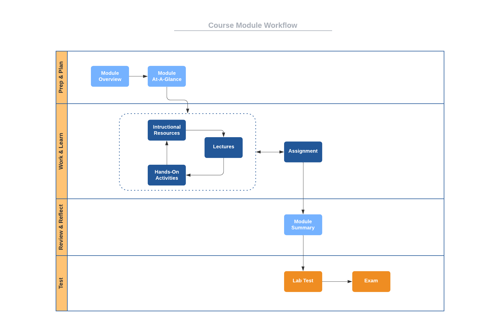

# Course Structure

This course is organized into eight modules numbered zero
through seven. Module 0 is an introductory "getting started" module, while Module 1 through Module 7 are course-content modules. Rather than being organized strictly by content, these modules are
[timeboxed](https://en.wikipedia.org/wiki/Timeboxing); that is, M1 - M7 are of fixed, equal durations with specific tasks to be completed within each. (If you're familiar with [agile methods](https://en.wikipedia.org/wiki/Agile_software_development), you'll recognize similarities to [Scrum](https://en.wikipedia.org/wiki/Scrum_(software_development)) sprints.)

Scheduling, planning, and knowing when things are due are easy with timeboxed modules. All graded items are scheduled to be due or delivered on module boundaries. Specifically: **Each graded item in the course is due on the last day of the module that contains it.** There are late days for assignments and slip days for exams, tests, and activities, but the actual due date for everything is the last day of each module.

The timeboxed organization of the course is as follows. Module 0 begins on the first day of classes for the term and ends on the first Sunday of the term. Each module 1-7 begins on a Monday and ends on the following Sunday.

Here is the specific schedule for [2023 Spring Term A](http://online.auburn.edu/term_calendar).

Module | Begin | End
------ | ----- | ---
M0 | Wed 11 Jan | Sun 15 Jan
M1 | Mon 16 Jan | Sun 22 Jan
M2 | Mon 23 Jan | Sun 29 Jun 
M3 | Mon 30 Feb | Sun 5 Feb
M4 | Mon 6 Feb  | Sun 12 Feb
M5 | Mon 13 Feb | Sun 19 Feb
M6 | Mon 20 Feb | Sun 26 Feb
M7 | Mon 27 Feb | Sun 5 Mar

# Module Structure

Each of the seven content modules has the same structure with the following components.

- **Module Overview:** A brief introduction to the module content.
- **Module At-A-Glance:** A more complete description of the module focus, tips
  for success, and learning objectives.
- **Instructional Resources:** Links to complete lecture notes for the module
  and references to associated readings from textbooks.
- **Lectures:** Links to complete instructional videos tied to the lecture
  notes.
- **Assignments:** One or more activities designed to help you put into practice the topics being presented in the notes.
- **Project Assignment:** An assignment that builds on the previous project assignment in building a secure software development pipeline
- **Summary:** A brief recap of what was covered in the module.

In addition to these common elements, Module 4 and 7 have:

- **Exam:** A timed Canvas exam that tests your overall mastery of the content in the current module and one or more previous modules.

# Workflow

Since each content module has the same structure, you can apply the same process to going through each. Here is a suggested
[workflow](https://en.wikipedia.org/wiki/Workflow) for going through each module of this course.

Notice the iterative nature of the items in the *Work & Learn*
[swimlane](https://en.wikipedia.org/wiki/Swim_lane). Rather than going through this portion of the module sequentially, I strongly encourage you to take an
[iterative](https://en.wikipedia.org/wiki/Iteration) approach. Read a portion of the notes, then watch the associated lecture videos, and then do the associated
hands-on activities (if any). I also suggest that you start the assignment at  the beginning of the module and interleave your work on the assignment with the notes/lecture/assignment cycle. Since most assignments are based on material
covered in previous modules, this interleaving is easy to do.
