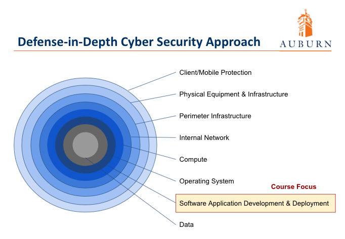

# Security in Source Code Management Part 1

This module covers secure software development practices during the initial phase of the software development process.  This part involves the people aspect to analyze the software system being constructed against standard areas of vulnerabilities and identify areas of risks that need to be mitigated.  We use the term mitigated as it is not possible to eliminate all risk.  Our goal is to harden the software application and avoid making the assumption that a software application is completely secure.  As discussed in module 1, security practices during software development is one layer in a defense in depth approach to cyber security.

The security practices focused on during this module are the manual inspection aspect of performing code analysis and review against known vulnerability areas.  Once changes are made to source code the software version control and change control process to a protected branch are executed.  In addition to the manual process we will begin to build our secure automated build pipeline, getting ready to incorporate more automated security tools in upcoming modules.

