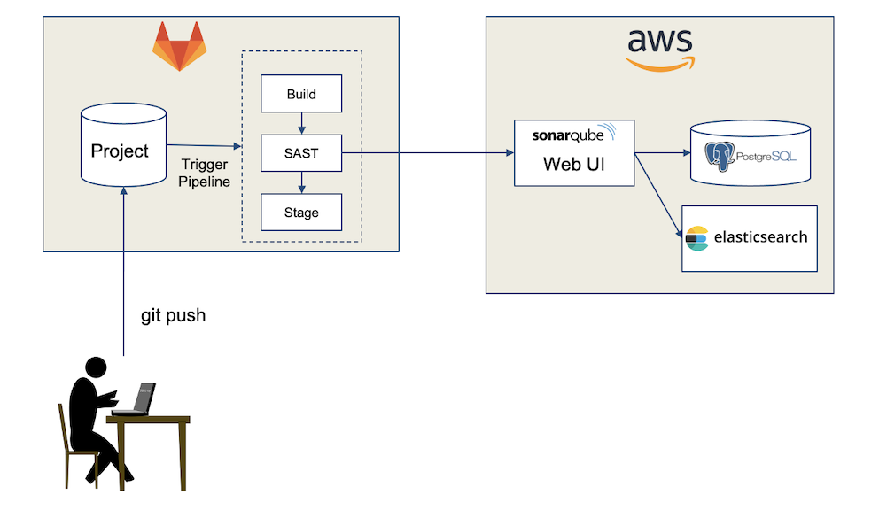

# Static Application Security Testing (SAST)

SAST Tools are important to support the agile and early discovery of security vulnerabilities in a software application.  It is important to understand it's capabilties and limitations in the context of security testing.
> [*Video: SAST Security Testing*](https://auburn.hosted.panopto.com/Panopto/Pages/Viewer.aspx?id=f0afb744-4469-4429-abff-aeac00f7cf7e)

---

# SonarQube SAST Tool 

SonarQube is on of the most widely used and mature SAST tools in the industry.  It supports the most common programming languages and incorporates and references to vulnerabilities and associated resolutions.  

> [*Video: SonarQube Lecture*](https://auburn.hosted.panopto.com/Panopto/Pages/Viewer.aspx?id=d4306e17-27dd-4271-8475-aeac01021639) 

Before we dive into the functional use of SonarQube this diagram and video provides an overview of the deployment setup.

> [*Video: SonarQube Setup*](https://auburn.hosted.panopto.com/Panopto/Pages/Viewer.aspx?id=d4306e17-27dd-4271-8475-aeac01021639)

    
